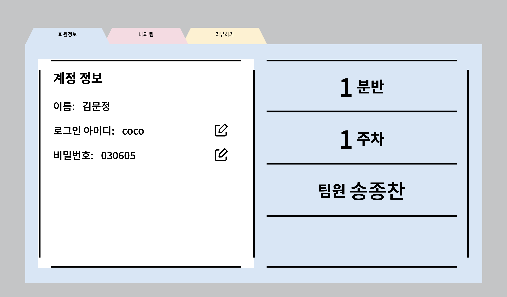

# MadCamp_Week4_Front

# The Hitchhiker’s Guide to the MadCamp

몰입캠프를 여행하는 히치하이커를 위한 안내서입니다.

몰입캠프의 참가자와 운영진에게 도움이 될 서비스를 웹으로 구현해 보았습니다.

팀원 선정, 투표 등  몰입캠프의 시작부터 마지막 발표까지 모든 과정에서 가이드를 제공합니다!

# Team

KAIST SoC 22

[Seyeon321 - Overview](https://github.com/Seyeon321)

KAIST SoC 22

[coco483 - Overview](https://github.com/coco483)

# Tech Stack

**Front-end**: JavaScript, HTML, CSS

**Back-end**: JavaScript, NodeJS, MySQL

**IDE**: VSCode

**CLOUD**: AWS

# Preview

**Admin Page**

전체적인 디자인 컨셉은 ‘파일철’로 정했습니다.

(위 영상에서 처럼, 브라우저에 따라 파일철이 맨 앞으로 튀어나오는 기능이 구현되지 않을 수도 있습니다. Microsoft edge를 사용하는 것을 권장드립니다.)

운영진은 분반을 생성하고, 학생을 추가하고, 랜덤으로 생성된 id와 password를 확인할 수 있습니다.

여기서 보이는 초기 id와 password를 user들에게 안내하면 됩니다. 경우에 따라 학생을 삭제할 수도 있습니다.

‘운영하기’ 페이지에서는 분반과 주차를 선택한 뒤, 존재하는 팀에 대해 랜덤으로 발표 순서를 부여할 수 있습니다.

이때 생성된 순서는 추후 user의 투표하기 페이지에 반영됩니다.

오른쪽에 뜨는 순서를 확인한 뒤 하단의 화살표 버튼을 누르면 학생들의 발표가 시작됩니다. 

발표 시작 이후엔 순서 변경 불가능합니다.

가운데 하단의 ‘금픽 계산하기’버튼을 누르면 user들의 투표 data를 바탕으로 이주의 금픽을 계산하게 됩니다.

금픽 계산 알고리즘은 본래 사용하던 구글폼의 것을 참고하였습니다.

금픽에 당첨된 상위 두 팀을 화면에 보여줍니다.

금픽 계산하기 버튼을 누를 시 해당 분반, 주차에 대한 모든 기능은 종료되므로,

모든 user들이 투표를 종료한 시점 이후에 눌러야 합니다.

**User Page**

처음 로그인하는 user의 경우 운영진으로부터 안내받은 초기 id와 password로 로그입합니다.

‘회원 정보’ 페이지에서는 해당 user의 기본 정보를 확인할 수 있고, id와 password를 수정할 수 있습니다.

‘나의 팀’ 페이지에서는 주차 별 나의 팀 메이트를 확인할 수 있고, 새로운 팀을 만들 수도 있습니다.

팀을 만들 땐 내가 직접 만드는 방법과, 이미 만들어진 팀에 참여하는 두 가지 방법이 있습니다.

팀을 직접 만드는 경우, 팀명과 팀원 제한을 설정하여야 합니다.

이미 존재하는 팀명의 경우 ‘누군가가 같은 팀명을 사용하고 있습니다’라는 문구가 보여집니다.

기존에 만들어져 있는 팀에 참여하는 경우, 팀명을 입력하면 자동으로 추가됩니다.

존재하지 않는 팀명을 적은 경우 ‘팀을 찾을 수 없습니다’라는 문구가 보여집니다.

이때 만들어진 팀들은 admin이 설정한 주차의 팀으로 자동 설정됩니다.

아직 발표 시작 전이라면, ‘아직 발표가 시작되지 않았습니다’라는 문구가 보여집니다.

admin이 해당 분반, 주차에서 발표 시작 버튼을 눌렀다면 user의 화면에서 자동으로 투표가 열리게 됩니다.

admin이 설정한 발표 순서대로 투표지가 보여집니다.

우측 하단의 next 버튼을 누르면 다음 순서 팀의 투표지로 넘어가고,

좌측 하단의 back 버튼을 누르면 이전 팀으로 돌아갈 수 있습니다.

마지막 팀 투표를 모두 마친 뒤 우측 하단의 submit 버튼을 누르면 나의 투표 결과가 admin에게 전달됩니다.

이 결과는 admin이 금주의 금픽을 계산할 때 사용됩니다.

# Details

### HTTP 통신

백엔드에서 http request를 받아 처리합니다.

Header에는 jwt token을 포함하며, json body에 필요한 parameter를 넣어 처리하였습니다.

### LOGIN

프론트에서 http request를 통해 백엔드에 토큰을 요청합니다.

보안을 위해 id/pw를 parameter 대신 json body에 넣어 GET이 아닌 POST로 처리하였습니다. 

아이디/비밀번호가 올바른 경우, 유저를 식별할 수 있는 jwt토큰을 발행합니다.

프론트에서 쿠키에 토큰을 저장하고 앞으로의 http request의 header에 authorization을 추가하여 사용합니다.

### REVIEW

admin 계정이 분반과 주차를 지정하여 발표순서를 랜덤으로 결정하고 투표를 시작합니다. 

투표가 시작되면 유저의 리뷰하기 페이지에서 지정된 순서대로 리뷰를 할 수 있습니다.

admin계정이 금픽 계산하기를 누르면 투표가 종료되고 금픽을 계산합니다.

### TEAMS

team과 student는 many-to-many 관계를 가지고 있습니다. 

팀 만들기/참여하기에서 팀명을 identifier로 사용하기 때문에 중복 팀명을 사용할 수 없습니다.

# DB Schema

# Github repository

Front-end

https://github.com/Seyeon321/MadCamp_Week4_Front.git

Back-end

https://github.com/coco483/madcamp_week4_backend.git
